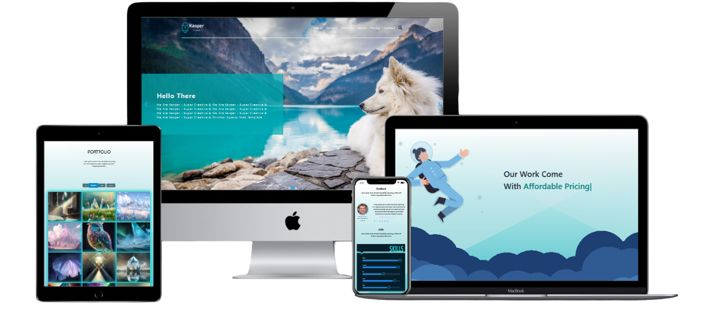

<h1 align="center" >Kasper Agency</h1>

  

**Kasper** is a creative agency with a team of **web developers**, **designers**, **graphic** artists, and **UI/UX** experts dedicated to enhancing your business.

This is a **responsive** website designed using vanilla **CSS** and **JavaScript**, guaranteeing exceptional **performance** and achieving **SEO** & **Accessibility** scores of (**+90**).
**even in mobile devices !!**

 If you appreciate it, please consider giving it a star ⭐
     
     
    <a href="https://issam-seghir.github.io/Kasper-Agency/">View Demo</a>
    .
    <a href="https://github.com/issam-seghir/Kasper-Agency/issues">Report Bug</a>
    .
    <a href="https://github.com/issam-seghir/Kasper-Agency/issues">Request Feature</a>
  

 

 
<b>Desktop</b>

 

<b>Mobile (click to toggle)</b>
 

Created with [Lighthouse-Badger](https://github.com/myactionway/lighthouse-badger-action "Get it") ✨

<!--  -->

## About The Project
 This is a modern, creative, and innovative website designed to showcase our digital agency's services and capabilities. We're dedicated to helping businesses and brands bring their visions to life through cutting-edge design, development, and marketing solutions.

- Services
  - Graphic Design: Elevate your brand's visual identity with captivating designs.
  - Web Design: Create stunning, user-friendly websites tailored to your business.
  - UI and UX: Craft memorable digital experiences with intuitive user interfaces.
  - Web Development: Transform web concepts into responsive, efficient websites.

### Built With

- Langauge

  
  
  

- illustration

  

- JS library

  
  
  

<!-- CONTRIBUTING -->
## Contributing

Contributions are what make the open source community such an amazing place to learn, inspire, and create. Any contributions you make are **greatly appreciated**.

If you have a suggestion that would make this better, please fork the repo and create a pull request. You can also simply open an issue with the tag "enhancement".
Don't forget to give the project a star! Thanks again!

1. Fork the Project
2. Create your Feature Branch (`git checkout -b feature/AmazingFeature`)
3. Commit your Changes (`git commit -m 'Add some AmazingFeature'`)
4. Push to the Branch (`git push origin feature/AmazingFeature`)
5. Open a Pull Request

<!-- LICENSE -->
## License

Distributed under the MIT License. See `LICENSE.txt` for more information.

## Support Me

